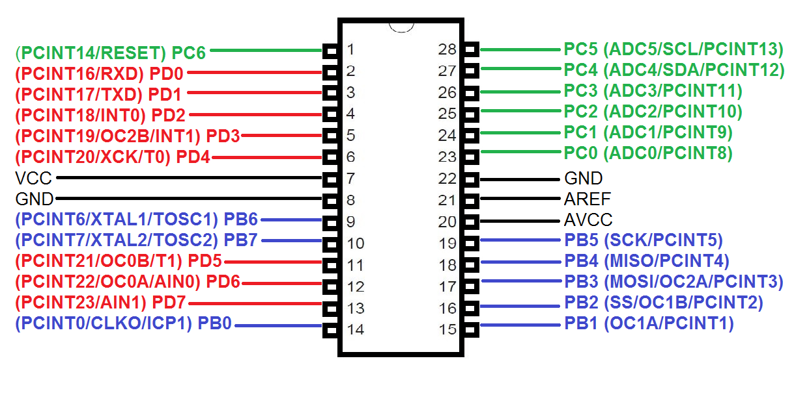
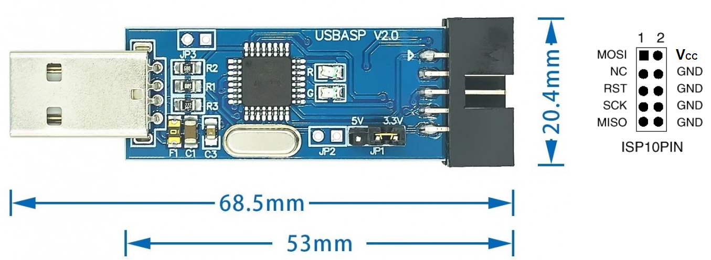
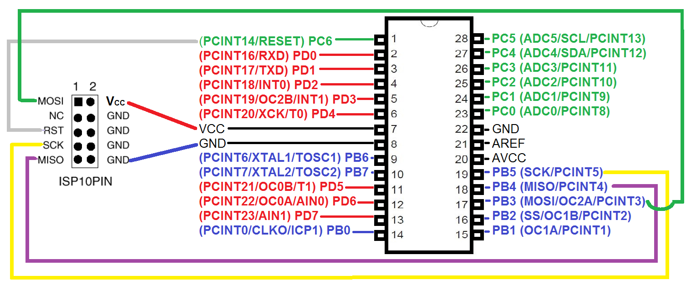
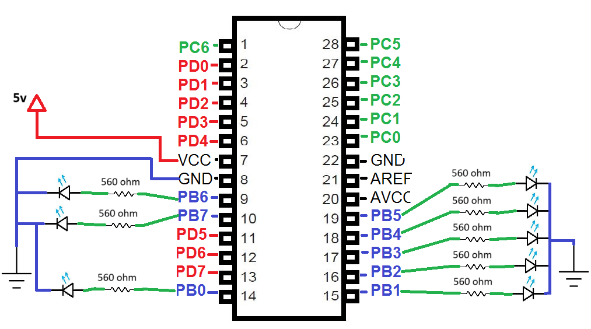

# Subject

we want to upload a `BitShifting` `LED` program into the `ATmega328P-PU` by the help of `USBasp V2.0` programmer.


# Used Electronic Parts

- `USBasp` programmer
- Solderless breadboard
- six female to male jumper wires
- three male to male jumper wires
- eight red 5 mm LED
- eight 560 ohm 0.25 w resistor
- one breadboard power supply
- one `ATmega328P-PU` microcontroller 


# Steps

to accomplish the subject, we will do the following steps respectively:

- preparing environment.
  - refer to https://github.com/hamedvalizadeh/electronic-tutorial/tree/master/Embedded_Programming/Programming-ATtiny45-With-WinAVR
- write the `BitShifting` program.
- wiring `ATmega328P-PU` with `USBasp` to be ready for program upload.
- test the `USBasp` programmer.
- upload the code.
- wiring `ATmega328P-PU` with `LEDs` and power supply.


# `BitShifting` Program

in a directory for example named `test` create a file named `main.c`, open it in a text editor, and paste the following lines of code in it:


```c
#include <avr/io.h>
#include <util/delay.h>

#define TIME 100

int main(void)
{
uint8_t i;
DDRB = 0b11111111;

while(1)
{
    for (i = 0; i < 8; i++)
    {
        _delay_ms(TIME);
        PORTB = 0b00000001 << i;
    }

    for (i = 1; i < 7; i++)
    {
        _delay_ms(TIME);
        PORTB = 0b10000000 >> i;
    }
    }
    return 0;             
}
```


based on the following image, the `ATmega328P-PU` has 28 pins, and 3 Ports named B, C, and D; in this tutorial we want to use all ports of `PORTB` as OUTPUT.




to work with pins of a microcontroller following consideration is important:

- data direction of the pin, which specifies that the pin is set to accept voltage as input, or is set to send voltage as output. this is done by a register which is known as data direction register abbreviated with `DDR`, and each port has one for itself. based on the fact that `ATmega328P-PU` has three ports named `B`, `C`, and `D`, so we have registers `DDRB`, `DDRBC, and `DDRD`.


as in our program we want to set the all ports  of `PORTB` as output, we set the value of `DDRB` equal to `0b11111111`. by the following table, it will be clear how the value is identified:

| Port Name  |  PB7   |  PB6   |  PB5   |  PB4   |  PB3   |  PB2   |  PB1   |  PB0   |
| :--------: | :----: | :----: | :----: | :----: | :----: | :----: | :----: | :----: |
| Pin Number |   10   |   9    |   19   |   18   |   17   |   16   |   15   |   14   |
|    DDRB    | OUTPUT | OUTPUT | OUTPUT | OUTPUT | OUTPUT | OUTPUT | OUTPUT | OUTPUT |
| DDRB value |   1    |   1    |   1    |   1    |   1    |   1    |   1    |   1    |


to send value to a pin we should use the port register of the desired port, which here is `PORTB`. if we want to send it logical 1 to all ports, we set it as `0b11111111` and if we want to send it logical 0 to all ports we set it as `0b00000000`.

in our program we used bit shifter to shift all initial value of `0b00000001` to the left by the amount specified by the loop variable in each iterate..


# Wiring Programmer

to be able to wire `ATmega328P-PU` with `USBasp` we need to know the pinout of each. as we mentioned the pinout of `ATmega328P-PU` in previous section titled `Blink Program`, here we show just `USBasp` programmer pinout as the following image:

 


we should connect pins as following table:

| `USBasp` | `USBasp`  |
| :------: | :-------: |
|  `RST`   | `PC5`, 1  |
|  `GND`   | `GND`, 8  |
|  `VCC`   | `VCC`, 7  |
|  `SCK`   | `PB5`, 19 |
|  `MISO`  | `PB4`, 18 |
|  `MOSI`  | `PB3`, 17 |


so the drawing connection would be as follow:




# Test the Programmer

after wiring it, connect the `USBasp` to the USB port of you computer, then open a `CMD` and execute the following command on it:

```cmd
avrdude -p m328p -c usbasp -B 4
```


in this command we specified to change internal processing speed of the microcontroller `ATmega328P-PU` to 187.5 kHz, using the `USBasp` as programmed.

if it works successfully you should see the message `avrdude: safemode: Fuses Ok` at the one line before the last line of the entire message written in the console.


# Upload Program

to upload program you should configure fuses in microcontroller, build the program code in `main.c` to a file named `main.hex`, and then upload it to the micro.

all of the above needed steps could be done manually with separate commands, but we can pack all of them in a file named `Makefile` (name of this file should not has not any extension name). so beside the file `main.c` create file named `Makefile` and copy the following content into it:

```cmd
# This makefile is for an ATmega328P-PU at 1 MHz, USBasp programmer
# 
# This is a prototype Makefile. Modify it according to your needs.
# You should at least check the settings for
# DEVICE ....... The AVR device you compile for
# CLOCK ........ Target AVR clock rate in Hertz
# OBJECTS ...... The object files created from your source files. This list is
#                usually the same as the list of source files with suffix ".o".
# PROGRAMMER ... Options to avrdude which define the hardware you use for
#                uploading to the AVR and the interface where this hardware
#                is connected. I am using Arduino UNO as ISP and for this the
#                programmer is avrisp
# FUSES ........ Parameters for avrdude to flash the fuses appropriately.
 
DEVICE     = atmega328p
CLOCK      = 1000000
PORT_LX    = /dev/ttyACM0
PORT_MAC   = /dev/tty.usbmodemfa131
PROGRAMMER = -c USBasp 
OBJECTS    = main.o
FUSES      = -U lfuse:w:0x62:m -U hfuse:w:0xdf:m -U efuse:w:0xff:m
 
#
# For computing fuse byte values for other devices and options see
# the fuse bit calculator at http://www.engbedded.com/fusecalc/
 
# Tune the lines below only if you know what you are doing:
 
AVRDUDE = avrdude $(PROGRAMMER) -p $(DEVICE) -B 4
COMPILE = avr-gcc -Wall -Os -Iusbdrv -DF_CPU=$(CLOCK) -mmcu=$(DEVICE)
 
# symbolic targets:
all:    main.hex
 
.c.o:
	$(COMPILE) -c $< -o $@
 
.S.o:
	$(COMPILE) -x assembler-with-cpp -c $< -o $@
# "-x assembler-with-cpp" should not be necessary since this is the default
# file type for the .S (with capital S) extension. However, upper case
# characters are not always preserved on Windows. To ensure WinAVR
# compatibility define the file type manually.
 
.c.s:
	$(COMPILE) -S $< -o $@
 
flash:  all
	$(AVRDUDE) -U flash:w:main.hex:i
 
fuse:
	$(AVRDUDE) $(FUSES)
 
# Xcode uses the Makefile targets "", "clean" and "install"
install: flash fuse
 
# if you use a bootloader, change the command below appropriately:
load: all
	bootloadHID main.hex
 
clean:
	rm -f main.hex main.elf $(OBJECTS) *~
 
# file targets:
main.elf: $(OBJECTS)
	$(COMPILE) -o main.elf $(OBJECTS)
 
main.hex: main.elf
	rm -f main.hex
	avr-objcopy -j .text -j .data -O ihex main.elf main.hex
#   avr-size --format=avr --mcu=$(DEVICE) main.elf
# If you have an EEPROM section, you must also create a hex file for the
# EEPROM and add it to the "flash" target.
 
# Targets for code debugging and analysis:
disasm: main.elf
	avr-objdump -d main.elf
 
cpp:
	$(COMPILE) -E main.c

```


finally open `CMD` and navigate to the direction in which the files `Makefile` and `main.c` resides, and execute the following command:

```cmd
make flash
```


if it works successfully you should see the message `avrdude: safemode: Fuses Ok` at the one line before the entire message written in the console.


# Wiring `ATmega328P-PU` with `LED`

now that we have our program uploaded into `ATmega328P-PU`, we need to see if our program works properly or not. to find the result, we should wire our final circuit and power it.

the circuit diagram is as follow:

