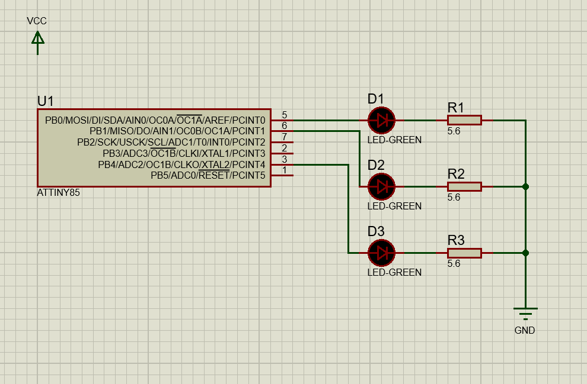

# Subject

we want to write 2 basic sample programs to show how to activate and disactivate  `PWM` on ports `PB0`, `PB1`, and `PB4`.


# Used Electronic Parts

- one `ATTiny85` microcontroller 
- `USBasp` programmer
- Solderless breadboard
- 8 male to male jumper wires
- 3 red 5 mm LEDs
- 3 560 ohm 0.25 w resistor
- one breadboard power supply


# Circuit

the circuit would be as follow:




# Program 1

in this program we want to do the following steps:

- activate `PWM` on ports `PB0`, `PB1`, and `PB4`.
- assign values 5, 25, and 99 respectively to them.
- wait for a 2 seconds.
- disactivate `PWM` on ports `PB0`, `PB1`, and `PB4`.
- turn on `PB0` on for 1 second.
- turn off `PB0` on for 1 second.
- repeat whole above steps infinitely.


```c
#include <avr/io.h>
#include <util/delay.h>

void set_output_directn_portpb()
{
    // set PB4, PB1, PB0 as outputs
    DDRB |= (1 << PORTB4) | (1 << PORTB1) | (1 << PORTB0);
}

void init_pwm_timre_0()
{
    // set timer mode to FAST PWM
    TCCR0A |= (1 << WGM01) | (1 << WGM00);
}

void connet_pwn_pb0()
{
    init_pwm_timre_0();

    // connect PWM signal to pin (OC0A => PB0)
    TCCR0A |= (1 << COM0A1);
    // no prescaler
    TCCR0B |= (1 << CS00);
}

void connet_pwn_pb1()
{
    init_pwm_timre_0();

    // connect PWM signal to pin (OC0B => PB0)
    TCCR0A |= (1 << COM0B1);
}

void connet_pwn_pb4()
{
    // connect PWM signal to pin (OCR0B => PB4)
    TCCR1 |= (1 << PWM1A) | (1 << COM1A0);
    // toggle PB4 when when timer reaches OCR1B (target)
    GTCCR |= (1 << COM1B0);
    // clear PB4 when when timer reaches OCR1C (top)
    GTCCR |= (1 << PWM1B);
    // no prescaler
    TCCR1 |= (1 << CS10);
}

void init_pwm_all(void)
{
    set_output_directn_portpb();
    connet_pwn_pb0();
    connet_pwn_pb1();
    connet_pwn_pb4();
}

void stop_Timre_0()
{
    // Turn off fastPWM for PORTB0/1
    TCCR0A &= ~(1 << WGM01) & ~(1 << WGM00);
}

void disconnect_pwm_pb0()
{
    // Disconnect PWM from PORTB0
    TCCR0A &= ~(1 << COM0A1);
}

void disconnect_pwm_pb1()
{
    // Disconnect PWM from PORTB1
    TCCR0A &= ~(1 << COM0B1);
}

void disconnect_pwm_pb4()
{
    // Turn off PWM for PORTB4
    TCCR1 &= ~(1 << PWM1A) & ~(1 << COM1A0);
    // Disconnect PWM from PORTB4 off timer/counter
    TCCR1 &= ~(1 << CS10);
    // Disable PWM for PORTB4
    GTCCR &= ~(1 << PWM1B);
    // Disconnect PWM from PORTB4
    GTCCR &= ~(1 << COM1B0);
}

void disconnect_pwm_all()
{
    stop_Timre_0();
    disconnect_pwm_pb0();
    disconnect_pwm_pb1();
    disconnect_pwm_pb4();
}

int main(void)
{
    while (1)
    {
        init_pwm_all();

        OCR0A = 5;  // PB0
        OCR0B = 25; // PB1
        OCR1B = 99; // PB4

        _delay_ms(2000);

        disconnect_pwm_all();

        PORTB &= ~(1 << PB0);

        PORTB |= (1 << PB0);
        _delay_ms(1000);
        PORTB &= ~(1 << PB0);
        _delay_ms(1000);
    }

    return 0;
}
```


# Program 2

in this program we want to do the following steps:

- activate `PWM` on ports `PB0`, `PB1`, and `PB4`.
- assign values 5, 25, and 99 respectively to them.
- wait for a 2 seconds.
- disactivate `PWM` on port `PB4`.
- turn off `PB4` on for 1 second.
- to toggle `PB4` on and off infinitely.

```c
#include <avr/io.h>
#include <util/delay.h>

void set_output_directn_portpb()
{
    // set PB4, PB1, PB0 as outputs
    DDRB |= (1 << PORTB4) | (1 << PORTB1) | (1 << PORTB0);
}

void init_pwm_timre_0()
{
    // set timer mode to FAST PWM
    TCCR0A |= (1 << WGM01) | (1 << WGM00);
}

void connet_pwn_pb0()
{
    init_pwm_timre_0();

    // connect PWM signal to pin (OC0A => PB0)
    TCCR0A |= (1 << COM0A1);
    // no prescaler
    TCCR0B |= (1 << CS00);
}

void connet_pwn_pb1()
{
    init_pwm_timre_0();

    // connect PWM signal to pin (OC0B => PB0)
    TCCR0A |= (1 << COM0B1);
}

void connet_pwn_pb4()
{
    // connect PWM signal to pin (OCR0B => PB4)
    TCCR1 |= (1 << PWM1A) | (1 << COM1A0);
    // toggle PB4 when when timer reaches OCR1B (target)
    GTCCR |= (1 << COM1B0);
    // clear PB4 when when timer reaches OCR1C (top)
    GTCCR |= (1 << PWM1B);
    // no prescaler
    TCCR1 |= (1 << CS10);
}

void init_pwm_all(void)
{
    set_output_directn_portpb();
    connet_pwn_pb0();
    connet_pwn_pb1();
    connet_pwn_pb4();
}

void stop_Timre_0()
{
    // Turn off fastPWM for PORTB0/1
    TCCR0A &= ~(1 << WGM01) & ~(1 << WGM00);
}

void disconnect_pwm_pb0()
{
    // Disconnect PWM from PORTB0
    TCCR0A &= ~(1 << COM0A1);
}

void disconnect_pwm_pb1()
{
    // Disconnect PWM from PORTB1
    TCCR0A &= ~(1 << COM0B1);
}

void disconnect_pwm_pb4()
{
    // Turn off PWM for PORTB4
    TCCR1 &= ~(1 << PWM1A) & ~(1 << COM1A0);
    // Disconnect PWM from PORTB4 off timer/counter
    TCCR1 &= ~(1 << CS10);
    // Disable PWM for PORTB4
    GTCCR &= ~(1 << PWM1B);
    // Disconnect PWM from PORTB4
    GTCCR &= ~(1 << COM1B0);
}

void disconnect_pwm_all()
{
    stop_Timre_0();
    disconnect_pwm_pb0();
    disconnect_pwm_pb1();
    disconnect_pwm_pb4();
}

int main(void)
{
    init_pwm_all();

    OCR0A = 5;  // PB0
    OCR0B = 25; // PB1
    OCR1B = 99; // PB4

    _delay_ms(2000);
    disconnect_pwm_pb4();
    PORTB &= ~(1 << PB4);

    while (1)
    {
        PORTB ^= (1 << PB4);
        _delay_ms(1000);
    }

    return 0;
}
```


# Upload Programs

to upload programs refer to the tutorial https://github.com/hamedvalizadeh/electronic-tutorial/blob/master/Embedded_Programming/Programming-ATtiny45-With-WinAVR/Document.md