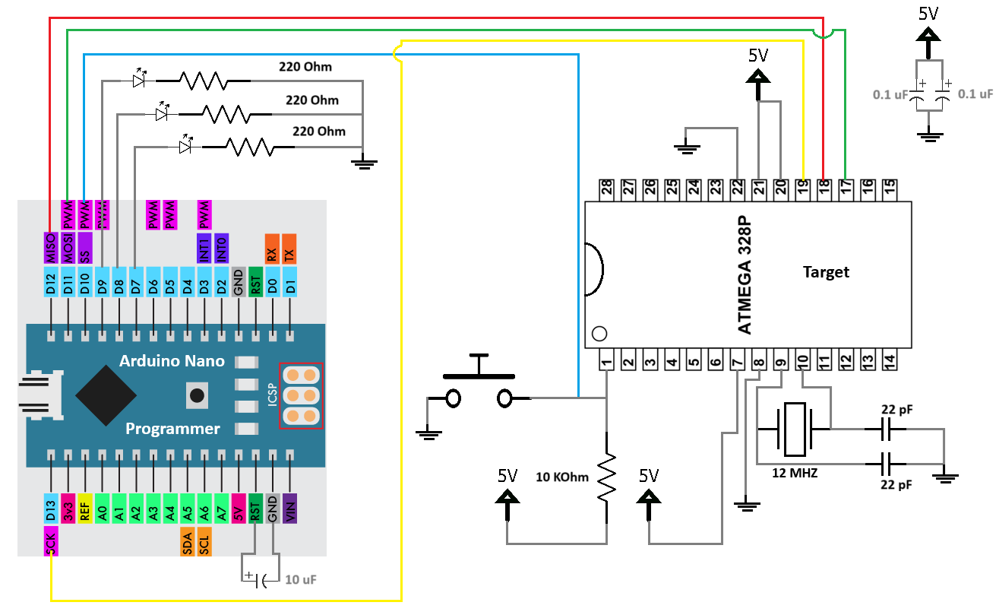
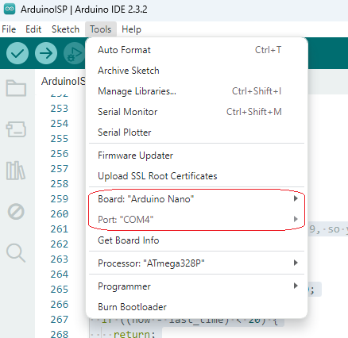
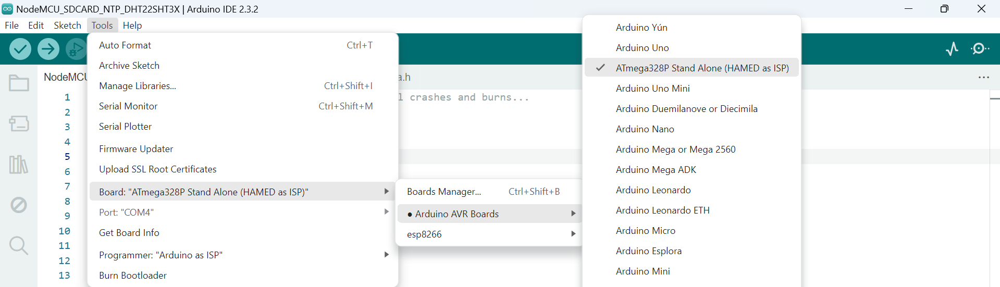
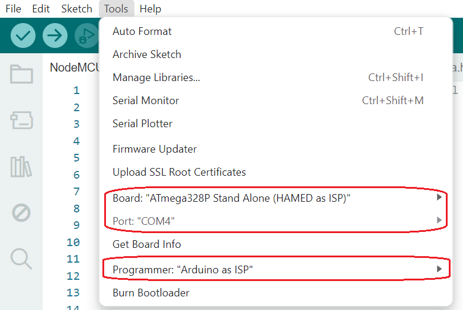
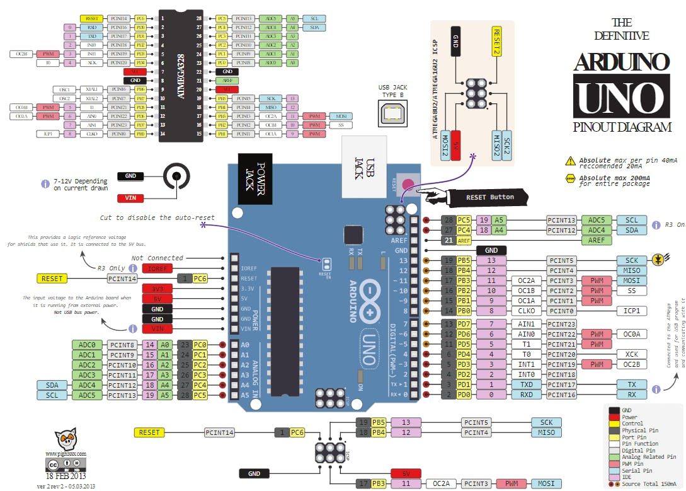

# Subject

we want to program `Blink` Example sketch on `Arduinio IDE` to an `Atmega328P-PU` MCU with the help of an `Arduino Nano` development board and `Arduino IDE`.


**Caution:** the version of Arduino IDE used in this tutorial is `2.3.2`.


#  Used electronic Parts

- Arduino Nano Development board
- four LEDs (suggested colors are 2 red, 1 green, and 1 yellow)
- 12000 MHz Crystal
- five 220 Ohm resistors.
- one breadboard
- a push button switch
- two 22 pF ceramic capacitors
- Atmega328P-PU
- male to male jumper wires
- one 10uF electrolytic capacitor (minimum 10 volt)
- two 0.1uF electrolytic capacitor (minimum 10 volt)


the circuit to create in this tutorial would be as follow:




**Cation:** at the moment of assembling above circuit on the breadboard, i hadn't 22 pF ceramic capacitors, but i had couple of capacitors with the 100 pF and 120 pF capacitance, so i decided to achieve the number 22 pF by creating a very simple circuit of series capacitors consists of three 120 pF and two 100 pF (this circuit results to approximate 22.222 pF total capacitance).

**Cation:** in some `Arduino Nano` boards that are cloned and not original, to prevent the Nano board from being reset on programming the target MCU, it is needed to keep the `reset` pin high. the best solution is to use a 10uF electrolytic capacitor between `RESET` and `GND` pins of the `Arduio Nao` board. my board worked well without this capacitor. 

**Caution:** if you find that targe MCU does not operate as expected, add two 0.1uF electrolytic capacitors between `VCC` and `GND`. ideally they should be as close to the MCU as possible. my chip worked well without them. 


by taking into consideration above mentioned cautions, used parts in our example are as following image:


# Prepare `Arduino Nano` as Programmer

as we want to write our `Bink` example sketch to `Atmega328P-PU` MCU by the the use of `Arduino Nano` board as programmer, so first we need to prepare this board to be able to do the task.

connect your `Arduino Nano` board to the USB port of your computer, then open `Arduino IDE`. 

now from the `File` menu click on menu item `Examples` and find the `ArduinoISP` and open it. in our `Arduino IDE` the example sketch `ArduinoISP`was in the path `File >> Examples >> 11.ArduinoISP >> ArduinoISP`. 

after opening the sketch `ArduinoISP`, it is recommended to change the delay between each heart beat from 40 milli seconds to 20 milli seconds in the method `heartbeat` (it is not obliges). 

then select `Arduino Nano` as `Board` and the port your board is using; in our tutorial environment at the development moment, it was as following image:

 


finally upload the sketch into the `Arduino Nano` developing board by clicking on the `Upload` button on the shortcut toolbar ribbon.

 


in our example the resulting sketch was as follow:

```c++
// ArduinoISP
// Copyright (c) 2008-2011 Randall Bohn
// If you require a license, see
// https://opensource.org/licenses/bsd-license.php
//
// This sketch turns the Arduino into a AVRISP using the following Arduino pins:
//
// Pin 10 is used to reset the target microcontroller.
//
// By default, the hardware SPI pins MISO, MOSI and SCK are used to communicate
// with the target. On all Arduinos, these pins can be found
// on the ICSP/SPI header:
//
//               MISO °. . 5V (!) Avoid this pin on Due, Zero...
//               SCK   . . MOSI
//                     . . GND
//
// On some Arduinos (Uno,...), pins MOSI, MISO and SCK are the same pins as
// digital pin 11, 12 and 13, respectively. That is why many tutorials instruct
// you to hook up the target to these pins. If you find this wiring more
// practical, have a define USE_OLD_STYLE_WIRING. This will work even when not
// using an Uno. (On an Uno this is not needed).
//
// Alternatively you can use any other digital pin by configuring
// software ('BitBanged') SPI and having appropriate defines for ARDUINOISP_PIN_MOSI,
// ARDUINOISP_PIN_MISO and ARDUINOISP_PIN_SCK.
//
// IMPORTANT: When using an Arduino that is not 5V tolerant (Due, Zero, ...) as
// the programmer, make sure to not expose any of the programmer's pins to 5V.
// A simple way to accomplish this is to power the complete system (programmer
// and target) at 3V3.
//
// Put an LED (with resistor) on the following pins:
// 9: Heartbeat   - shows the programmer is running
// 8: Error       - Lights up if something goes wrong (use red if that makes sense)
// 7: Programming - In communication with the target
//

#include "Arduino.h"
#undef SERIAL


#define PROG_FLICKER true

// Configure SPI clock (in Hz).
// E.g. for an ATtiny @ 128 kHz: the datasheet states that both the high and low
// SPI clock pulse must be > 2 CPU cycles, so take 3 cycles i.e. divide target
// f_cpu by 6:
//     #define SPI_CLOCK            (128000/6)
//
// A clock slow enough for an ATtiny85 @ 1 MHz, is a reasonable default:

#define SPI_CLOCK (1000000 / 6)


// Select hardware or software SPI, depending on SPI clock.
// Currently only for AVR, for other architectures (Due, Zero,...), hardware SPI
// is probably too fast anyway.

#if defined(ARDUINO_ARCH_AVR)

#if SPI_CLOCK > (F_CPU / 128)
#define USE_HARDWARE_SPI
#endif

#endif

// Configure which pins to use:

// The standard pin configuration.
#ifndef ARDUINO_HOODLOADER2

#define RESET 10  // Use pin 10 to reset the target rather than SS
#define LED_HB 9
#define LED_ERR 8
#define LED_PMODE 7

// Uncomment following line to use the old Uno style wiring
// (using pin 11, 12 and 13 instead of the SPI header) on Leonardo, Due...

// #define USE_OLD_STYLE_WIRING

#ifdef USE_OLD_STYLE_WIRING

#define ARDUINOISP_PIN_MOSI 11
#define ARDUINOISP_PIN_MISO 12
#define ARDUINOISP_PIN_SCK 13

#endif

// HOODLOADER2 means running sketches on the ATmega16U2 serial converter chips
// on Uno or Mega boards. We must use pins that are broken out:
#else

#define RESET 4
#define LED_HB 7
#define LED_ERR 6
#define LED_PMODE 5

#endif

// By default, use hardware SPI pins:
#ifndef ARDUINOISP_PIN_MOSI
#define ARDUINOISP_PIN_MOSI MOSI
#endif

#ifndef ARDUINOISP_PIN_MISO
#define ARDUINOISP_PIN_MISO MISO
#endif

#ifndef ARDUINOISP_PIN_SCK
#define ARDUINOISP_PIN_SCK SCK
#endif

// Force bitbanged SPI if not using the hardware SPI pins:
#if (ARDUINOISP_PIN_MISO != MISO) || (ARDUINOISP_PIN_MOSI != MOSI) || (ARDUINOISP_PIN_SCK != SCK)
#undef USE_HARDWARE_SPI
#endif


// Configure the serial port to use.
//
// Prefer the USB virtual serial port (aka. native USB port), if the Arduino has one:
//   - it does not autoreset (except for the magic baud rate of 1200).
//   - it is more reliable because of USB handshaking.
//
// Leonardo and similar have an USB virtual serial port: 'Serial'.
// Due and Zero have an USB virtual serial port: 'SerialUSB'.
//
// On the Due and Zero, 'Serial' can be used too, provided you disable autoreset.
// To use 'Serial': #define SERIAL Serial

#ifdef SERIAL_PORT_USBVIRTUAL
#define SERIAL SERIAL_PORT_USBVIRTUAL
#else
#define SERIAL Serial
#endif


// Configure the baud rate:

#define BAUDRATE 19200
// #define BAUDRATE	115200
// #define BAUDRATE	1000000


#define HWVER 2
#define SWMAJ 1
#define SWMIN 18

// STK Definitions
#define STK_OK 0x10
#define STK_FAILED 0x11
#define STK_UNKNOWN 0x12
#define STK_INSYNC 0x14
#define STK_NOSYNC 0x15
#define CRC_EOP 0x20  //ok it is a space...

void pulse(int pin, int times);

#ifdef USE_HARDWARE_SPI
#include "SPI.h"
#else

#define SPI_MODE0 0x00

#if !defined(ARDUINO_API_VERSION) || ARDUINO_API_VERSION != 10001  // A SPISettings class is declared by ArduinoCore-API 1.0.1
class SPISettings {
public:
  // clock is in Hz
  SPISettings(uint32_t clock, uint8_t bitOrder, uint8_t dataMode)
    : clockFreq(clock) {
    (void)bitOrder;
    (void)dataMode;
  };

  uint32_t getClockFreq() const {
    return clockFreq;
  }

private:
  uint32_t clockFreq;
};
#endif                                                             // !defined(ARDUINO_API_VERSION)

class BitBangedSPI {
public:
  void begin() {
    digitalWrite(ARDUINOISP_PIN_SCK, LOW);
    digitalWrite(ARDUINOISP_PIN_MOSI, LOW);
    pinMode(ARDUINOISP_PIN_SCK, OUTPUT);
    pinMode(ARDUINOISP_PIN_MOSI, OUTPUT);
    pinMode(ARDUINOISP_PIN_MISO, INPUT);
  }

  void beginTransaction(SPISettings settings) {
    pulseWidth = (500000 + settings.getClockFreq() - 1) / settings.getClockFreq();
    if (pulseWidth == 0) {
      pulseWidth = 1;
    }
  }

  void end() {}

  uint8_t transfer(uint8_t b) {
    for (unsigned int i = 0; i < 8; ++i) {
      digitalWrite(ARDUINOISP_PIN_MOSI, (b & 0x80) ? HIGH : LOW);
      digitalWrite(ARDUINOISP_PIN_SCK, HIGH);
      delayMicroseconds(pulseWidth);
      b = (b << 1) | digitalRead(ARDUINOISP_PIN_MISO);
      digitalWrite(ARDUINOISP_PIN_SCK, LOW);  // slow pulse
      delayMicroseconds(pulseWidth);
    }
    return b;
  }

private:
  unsigned long pulseWidth;  // in microseconds
};

static BitBangedSPI SPI;

#endif

void setup() {
  SERIAL.begin(BAUDRATE);

  pinMode(LED_PMODE, OUTPUT);
  pulse(LED_PMODE, 2);
  pinMode(LED_ERR, OUTPUT);
  pulse(LED_ERR, 2);
  pinMode(LED_HB, OUTPUT);
  pulse(LED_HB, 2);
}

int ISPError = 0;
int pmode = 0;
// address for reading and writing, set by 'U' command
unsigned int here;
uint8_t buff[256];  // global block storage

#define beget16(addr) (*addr * 256 + *(addr + 1))
typedef struct param {
  uint8_t devicecode;
  uint8_t revision;
  uint8_t progtype;
  uint8_t parmode;
  uint8_t polling;
  uint8_t selftimed;
  uint8_t lockbytes;
  uint8_t fusebytes;
  uint8_t flashpoll;
  uint16_t eeprompoll;
  uint16_t pagesize;
  uint16_t eepromsize;
  uint32_t flashsize;
} parameter;

parameter param;

// this provides a heartbeat on pin 9, so you can tell the software is running.
uint8_t hbval = 128;
int8_t hbdelta = 8;
void heartbeat() {
  static unsigned long last_time = 0;
  unsigned long now = millis();
  if ((now - last_time) < 20) {
    return;
  }
  last_time = now;
  if (hbval > 192) {
    hbdelta = -hbdelta;
  }
  if (hbval < 32) {
    hbdelta = -hbdelta;
  }
  hbval += hbdelta;
  analogWrite(LED_HB, hbval);
}

static bool rst_active_high;

void reset_target(bool reset) {
  digitalWrite(RESET, ((reset && rst_active_high) || (!reset && !rst_active_high)) ? HIGH : LOW);
}

void loop(void) {
  // is pmode active?
  if (pmode) {
    digitalWrite(LED_PMODE, HIGH);
  } else {
    digitalWrite(LED_PMODE, LOW);
  }
  // is there an error?
  if (ISPError) {
    digitalWrite(LED_ERR, HIGH);
  } else {
    digitalWrite(LED_ERR, LOW);
  }

  // light the heartbeat LED
  heartbeat();
  if (SERIAL.available()) {
    avrisp();
  }
}

uint8_t getch() {
  while (!SERIAL.available())
    ;
  return SERIAL.read();
}
void fill(int n) {
  for (int x = 0; x < n; x++) {
    buff[x] = getch();
  }
}

#define PTIME 30
void pulse(int pin, int times) {
  do {
    digitalWrite(pin, HIGH);
    delay(PTIME);
    digitalWrite(pin, LOW);
    delay(PTIME);
  } while (times--);
}

void prog_lamp(int state) {
  if (PROG_FLICKER) {
    digitalWrite(LED_PMODE, state);
  }
}

uint8_t spi_transaction(uint8_t a, uint8_t b, uint8_t c, uint8_t d) {
  SPI.transfer(a);
  SPI.transfer(b);
  SPI.transfer(c);
  return SPI.transfer(d);
}

void empty_reply() {
  if (CRC_EOP == getch()) {
    SERIAL.print((char)STK_INSYNC);
    SERIAL.print((char)STK_OK);
  } else {
    ISPError++;
    SERIAL.print((char)STK_NOSYNC);
  }
}

void breply(uint8_t b) {
  if (CRC_EOP == getch()) {
    SERIAL.print((char)STK_INSYNC);
    SERIAL.print((char)b);
    SERIAL.print((char)STK_OK);
  } else {
    ISPError++;
    SERIAL.print((char)STK_NOSYNC);
  }
}

void get_version(uint8_t c) {
  switch (c) {
    case 0x80:
      breply(HWVER);
      break;
    case 0x81:
      breply(SWMAJ);
      break;
    case 0x82:
      breply(SWMIN);
      break;
    case 0x93:
      breply('S');  // serial programmer
      break;
    default:
      breply(0);
  }
}

void set_parameters() {
  // call this after reading parameter packet into buff[]
  param.devicecode = buff[0];
  param.revision = buff[1];
  param.progtype = buff[2];
  param.parmode = buff[3];
  param.polling = buff[4];
  param.selftimed = buff[5];
  param.lockbytes = buff[6];
  param.fusebytes = buff[7];
  param.flashpoll = buff[8];
  // ignore buff[9] (= buff[8])
  // following are 16 bits (big endian)
  param.eeprompoll = beget16(&buff[10]);
  param.pagesize = beget16(&buff[12]);
  param.eepromsize = beget16(&buff[14]);

  // 32 bits flashsize (big endian)
  param.flashsize = buff[16] * 0x01000000
                    + buff[17] * 0x00010000
                    + buff[18] * 0x00000100
                    + buff[19];

  // AVR devices have active low reset, AT89Sx are active high
  rst_active_high = (param.devicecode >= 0xe0);
}

void start_pmode() {

  // Reset target before driving ARDUINOISP_PIN_SCK or ARDUINOISP_PIN_MOSI

  // SPI.begin() will configure SS as output, so SPI master mode is selected.
  // We have defined RESET as pin 10, which for many Arduinos is not the SS pin.
  // So we have to configure RESET as output here,
  // (reset_target() first sets the correct level)
  reset_target(true);
  pinMode(RESET, OUTPUT);
  SPI.begin();
  SPI.beginTransaction(SPISettings(SPI_CLOCK, MSBFIRST, SPI_MODE0));

  // See AVR datasheets, chapter "SERIAL_PRG Programming Algorithm":

  // Pulse RESET after ARDUINOISP_PIN_SCK is low:
  digitalWrite(ARDUINOISP_PIN_SCK, LOW);
  delay(20);  // discharge ARDUINOISP_PIN_SCK, value arbitrarily chosen
  reset_target(false);
  // Pulse must be minimum 2 target CPU clock cycles so 100 usec is ok for CPU
  // speeds above 20 KHz
  delayMicroseconds(100);
  reset_target(true);

  // Send the enable programming command:
  delay(50);  // datasheet: must be > 20 msec
  spi_transaction(0xAC, 0x53, 0x00, 0x00);
  pmode = 1;
}

void end_pmode() {
  SPI.end();
  // We're about to take the target out of reset so configure SPI pins as input
  pinMode(ARDUINOISP_PIN_MOSI, INPUT);
  pinMode(ARDUINOISP_PIN_SCK, INPUT);
  reset_target(false);
  pinMode(RESET, INPUT);
  pmode = 0;
}

void universal() {
  uint8_t ch;

  fill(4);
  ch = spi_transaction(buff[0], buff[1], buff[2], buff[3]);
  breply(ch);
}

void flash(uint8_t hilo, unsigned int addr, uint8_t data) {
  spi_transaction(0x40 + 8 * hilo,
                  addr >> 8 & 0xFF,
                  addr & 0xFF,
                  data);
}
void commit(unsigned int addr) {
  if (PROG_FLICKER) {
    prog_lamp(LOW);
  }
  spi_transaction(0x4C, (addr >> 8) & 0xFF, addr & 0xFF, 0);
  if (PROG_FLICKER) {
    delay(PTIME);
    prog_lamp(HIGH);
  }
}

unsigned int current_page() {
  if (param.pagesize == 32) {
    return here & 0xFFFFFFF0;
  }
  if (param.pagesize == 64) {
    return here & 0xFFFFFFE0;
  }
  if (param.pagesize == 128) {
    return here & 0xFFFFFFC0;
  }
  if (param.pagesize == 256) {
    return here & 0xFFFFFF80;
  }
  return here;
}


void write_flash(int length) {
  fill(length);
  if (CRC_EOP == getch()) {
    SERIAL.print((char)STK_INSYNC);
    SERIAL.print((char)write_flash_pages(length));
  } else {
    ISPError++;
    SERIAL.print((char)STK_NOSYNC);
  }
}

uint8_t write_flash_pages(int length) {
  int x = 0;
  unsigned int page = current_page();
  while (x < length) {
    if (page != current_page()) {
      commit(page);
      page = current_page();
    }
    flash(LOW, here, buff[x++]);
    flash(HIGH, here, buff[x++]);
    here++;
  }

  commit(page);

  return STK_OK;
}

#define EECHUNK (32)
uint8_t write_eeprom(unsigned int length) {
  // here is a word address, get the byte address
  unsigned int start = here * 2;
  unsigned int remaining = length;
  if (length > param.eepromsize) {
    ISPError++;
    return STK_FAILED;
  }
  while (remaining > EECHUNK) {
    write_eeprom_chunk(start, EECHUNK);
    start += EECHUNK;
    remaining -= EECHUNK;
  }
  write_eeprom_chunk(start, remaining);
  return STK_OK;
}
// write (length) bytes, (start) is a byte address
uint8_t write_eeprom_chunk(unsigned int start, unsigned int length) {
  // this writes byte-by-byte, page writing may be faster (4 bytes at a time)
  fill(length);
  prog_lamp(LOW);
  for (unsigned int x = 0; x < length; x++) {
    unsigned int addr = start + x;
    spi_transaction(0xC0, (addr >> 8) & 0xFF, addr & 0xFF, buff[x]);
    delay(45);
  }
  prog_lamp(HIGH);
  return STK_OK;
}

void program_page() {
  char result = (char)STK_FAILED;
  unsigned int length = 256 * getch();
  length += getch();
  char memtype = getch();
  // flash memory @here, (length) bytes
  if (memtype == 'F') {
    write_flash(length);
    return;
  }
  if (memtype == 'E') {
    result = (char)write_eeprom(length);
    if (CRC_EOP == getch()) {
      SERIAL.print((char)STK_INSYNC);
      SERIAL.print(result);
    } else {
      ISPError++;
      SERIAL.print((char)STK_NOSYNC);
    }
    return;
  }
  SERIAL.print((char)STK_FAILED);
  return;
}

uint8_t flash_read(uint8_t hilo, unsigned int addr) {
  return spi_transaction(0x20 + hilo * 8,
                         (addr >> 8) & 0xFF,
                         addr & 0xFF,
                         0);
}

char flash_read_page(int length) {
  for (int x = 0; x < length; x += 2) {
    uint8_t low = flash_read(LOW, here);
    SERIAL.print((char)low);
    uint8_t high = flash_read(HIGH, here);
    SERIAL.print((char)high);
    here++;
  }
  return STK_OK;
}

char eeprom_read_page(int length) {
  // here again we have a word address
  int start = here * 2;
  for (int x = 0; x < length; x++) {
    int addr = start + x;
    uint8_t ee = spi_transaction(0xA0, (addr >> 8) & 0xFF, addr & 0xFF, 0xFF);
    SERIAL.print((char)ee);
  }
  return STK_OK;
}

void read_page() {
  char result = (char)STK_FAILED;
  int length = 256 * getch();
  length += getch();
  char memtype = getch();
  if (CRC_EOP != getch()) {
    ISPError++;
    SERIAL.print((char)STK_NOSYNC);
    return;
  }
  SERIAL.print((char)STK_INSYNC);
  if (memtype == 'F') {
    result = flash_read_page(length);
  }
  if (memtype == 'E') {
    result = eeprom_read_page(length);
  }
  SERIAL.print(result);
}

void read_signature() {
  if (CRC_EOP != getch()) {
    ISPError++;
    SERIAL.print((char)STK_NOSYNC);
    return;
  }
  SERIAL.print((char)STK_INSYNC);
  uint8_t high = spi_transaction(0x30, 0x00, 0x00, 0x00);
  SERIAL.print((char)high);
  uint8_t middle = spi_transaction(0x30, 0x00, 0x01, 0x00);
  SERIAL.print((char)middle);
  uint8_t low = spi_transaction(0x30, 0x00, 0x02, 0x00);
  SERIAL.print((char)low);
  SERIAL.print((char)STK_OK);
}
//////////////////////////////////////////
//////////////////////////////////////////


////////////////////////////////////
////////////////////////////////////
void avrisp() {
  uint8_t ch = getch();
  switch (ch) {
    case '0':  // signon
      ISPError = 0;
      empty_reply();
      break;
    case '1':
      if (getch() == CRC_EOP) {
        SERIAL.print((char)STK_INSYNC);
        SERIAL.print("AVR ISP");
        SERIAL.print((char)STK_OK);
      } else {
        ISPError++;
        SERIAL.print((char)STK_NOSYNC);
      }
      break;
    case 'A':
      get_version(getch());
      break;
    case 'B':
      fill(20);
      set_parameters();
      empty_reply();
      break;
    case 'E':  // extended parameters - ignore for now
      fill(5);
      empty_reply();
      break;
    case 'P':
      if (!pmode) {
        start_pmode();
      }
      empty_reply();
      break;
    case 'U':  // set address (word)
      here = getch();
      here += 256 * getch();
      empty_reply();
      break;

    case 0x60:  //STK_PROG_FLASH
      getch();  // low addr
      getch();  // high addr
      empty_reply();
      break;
    case 0x61:  //STK_PROG_DATA
      getch();  // data
      empty_reply();
      break;

    case 0x64:  //STK_PROG_PAGE
      program_page();
      break;

    case 0x74:  //STK_READ_PAGE 't'
      read_page();
      break;

    case 'V':  //0x56
      universal();
      break;
    case 'Q':  //0x51
      ISPError = 0;
      end_pmode();
      empty_reply();
      break;

    case 0x75:  //STK_READ_SIGN 'u'
      read_signature();
      break;

    // expecting a command, not CRC_EOP
    // this is how we can get back in sync
    case CRC_EOP:
      ISPError++;
      SERIAL.print((char)STK_NOSYNC);
      break;

    // anything else we will return STK_UNKNOWN
    default:
      ISPError++;
      if (CRC_EOP == getch()) {
        SERIAL.print((char)STK_UNKNOWN);
      } else {
        SERIAL.print((char)STK_NOSYNC);
      }
  }
}

```

  

now connect LEDs on pins 9, 8, and 7 and power on the board. if every thing had been done correctly, the LED connected on pin 9 should blinks.

these LEDs are interfaces to show status of the programming process:

- LED connected to pin D9: this is the heartbeat indicator. if the `ArduinoISP` program is uploaded correctly on the `Arduino Nano` board, this LED would blink.
- LED connected to pin D8: this is the error on uploading code on Atmega328P-PU MCU indicator. if the code can not be uploaded on target MCU, this LED will be on.
- LED connected to pin D7: this indicates that uploading code on target MCU is in progress when blinking.


# Upload Code into Target MCU

in order to be able to upload code to `Atmega328P-PU` as target MCU, first connect it to the `Arduino Nano` board based on image of connection circuit provided at the beginning of this tutorial. also as a check list, you can refer to the following pin mapping:

- `Arduino Nano` D13 (SCK) to `ATmega328P-PU` pin 19 (SCK)
- `Arduino Nano` D12 (MISO) to `ATmega328P-PU` pin 18 (MISO)
- `Arduino Nano` D11 (MOSI) to `ATmega328P-PU`pin 17 (MOSI)
- `Arduino Nano` D10 (RESET) to `ATmega328P-PU`pin 1 (RESET)
- `Arduino Nano` 5v pin to `ATmega328P-PU` pins 20, 21, and 7, and to the pull-up resistor connected to pin 1
- `Arduino Nano` GND pin to `ATmega328P-PU` pins 8, 22, and both 22 pF capacitors lead that are connected to the crystal.


then upload bootloader to the `ATmega328P-PU`.


### Upload bootloader

`Atmga328P-PU` by default is set to use 1 MHZ internal clock. we want to use 12 MHZ external crystal as clock source. to do so we should program the fuses. the easiest way to program fuses is to burn bootloader into the MCU.

in `Arduino IDE` there are some definition templates for different boards, that are saved in a file named `boards.txt`. 

in our environment at the moment of developing this tutorial the path to this file was `C:\Users\[username]\AppData\Local\Arduino15\packages\arduino\hardware\avr\1.8.6\boards.txt` .

open this file and paste the following lines to the end or beginning of the file:

```powershell
##############################################################

atmegasa16.name=ATmega328P Stand Alone (HAMED as ISP)

atmegasa16.vid.0=0x2341
atmegasa16.pid.0=0x0043
atmegasa16.vid.1=0x2341
atmegasa16.pid.1=0x0001
atmegasa16.vid.2=0x2A03
atmegasa16.pid.2=0x0043
atmegasa16.vid.3=0x2341
atmegasa16.pid.3=0x0243
atmegasa16.vid.4=0x2341
atmegasa16.pid.4=0x006A
atmegasa16.upload_port.0.vid=0x2341
atmegasa16.upload_port.0.pid=0x0043
atmegasa16.upload_port.1.vid=0x2341
atmegasa16.upload_port.1.pid=0x0001
atmegasa16.upload_port.2.vid=0x2A03
atmegasa16.upload_port.2.pid=0x0043
atmegasa16.upload_port.3.vid=0x2341
atmegasa16.upload_port.3.pid=0x0243
atmegasa16.upload_port.4.vid=0x2341
atmegasa16.upload_port.4.pid=0x006A
atmegasa16.upload_port.5.board=uno

atmegasa16.upload.tool=arduino:avrdude
atmegasa16.upload.tool.default=avrdude
atmegasa16.upload.tool.network=arduino_ota
atmegasa16.upload.maximum_data_size=2048
atmegasa16.upload.protocol=arduino
atmegasa16.upload.maximum_size=32768
atmegasa16.upload.speed=115200

atmegasa16.bootloader.tool=arduino:avrdude
atmegasa16.bootloader.tool.default=avrdude
atmegasa16.bootloader.low_fuses=0xE2
atmegasa16.bootloader.high_fuses=0xDA
atmegasa16.bootloader.extended_fuses=0x05
atmegasa16.bootloader.unlock_bits=0x3F
atmegasa16.bootloader.lock_bits=0x0F
atmegasa16.bootloader.file=optiboot/optiboot_atmega328.hex

atmegasa16.build.mcu=atmega328p
atmegasa16.build.f_cpu=12000000L
atmegasa16.build.core=arduino:arduino
atmegasa16.build.variant=arduino:standard
```

 

for `Arduino IDE` to be able to read boards definition templates, it needs to be restarted. after restarting the IDE, you will find a new board named `ATmega328P Stand Alone (HAMED as ISP)` in `Boards` list as following image:

 


now connect `Arduino Nano` board while `Atmega328P-PU` is connected to it, to the USB port of your computer. then from `Tools` menu, select `ATmega328P Stand Alone (HAMED as ISP)` as `Board` and appropriate `Port`, and also select `Arduino as ISP` as the `Programmer`. the result configuration would be as follow:

 


finally click on `Burn Bootloader` from `Tools` menu. if every thing done correctly the LED connected to the pin 7 of `Arduino Nano` would blinks and you would see the message `bootloader installed successfully`.


### Upload Blink Sketch Code

open `Blink` example sketch, from `Tools` menu select `ATmega328P Stand Alone (HAMED as ISP)` as `Board` and choose an appropriate port, and also select `Arduino as ISP` as the `Programmer`. 

finally press shortcut keys `Ctrl + Shift + U`.  if every thing done correctly the LED connected to the pin 7 of `Arduino Nano` would blinks that indicates the upload is in process and at the end you would see the message `done upload`.

now connect and Anode pin of an LED to the pin 19 of `Atmega328P-PU` and connect a 220 Ohm resistor to the Cathode pin of the LED and connect the other pin of resistor to GND. the LED should blinks every 1 second.


**Caution:** a comprehensive guide for `Arduino Uno` which is similar to `Arduino Nano`, pin mapping to `Atmega328P-PU` would be the following image, which is from the website https://www.circuito.io/blog/arduino-uno-pinout/: 


