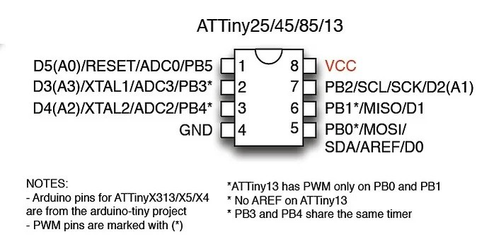
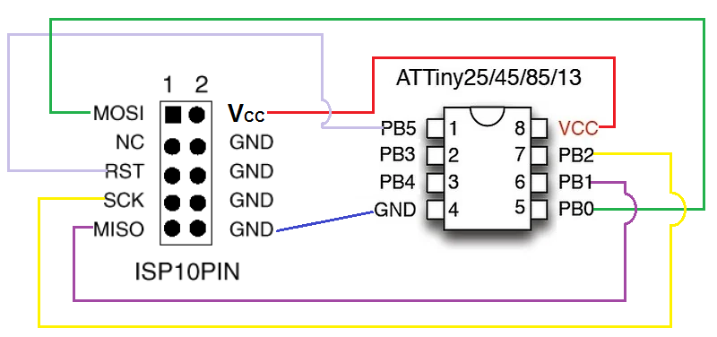
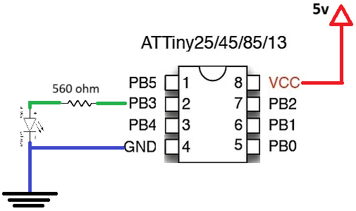

# Subject

we want to upload a `Blink` program into the `ATTiny45-20PU` by the help of `USBasp V2.0` programmer.


# Used Electronic Parts

- `USBasp` programmer
- Solderless breadboard
- six female to male jumper wires
- three male to male jumper wires
- one red 5 mm LED
- one 560 ohm 0.25 w resistor
- one breadboard power supply
- one `ATTiny45-20PU` microcontroller 


# Steps

to accomplish the subject, we will do the following steps respectively:

- preparing environment.
  - it includes installing `WINAVR` software version `WinAVR 20100110`, and driver for `USBasp` programmer.
- write the `Blink` program and upload it.
- wiring `ATTing45-20PU` with `USBasp` to be ready for program upload.
- test the `USBasp` programmer.
- upload the code.
- wiring `ATTiny-20PU` with `LED` and power supply.


# Prepare the Environment

in this tutorial we will use a tool called `AVRDUDE` to upload our program. this tool is included in a tool chain that are introduced as a package named `WINAvr`. so we need to download and install this software from the site `https://winavr.sourceforge.net/download.html`. at the time of writing this tutorial the latest version of `WINAvr` was `WinAVR 20100110`.

after downloading, simply run the `exe` file to start the process of installing and do not change any configuration during installation and in each installation step just click on `Next` button, but at the step named `Choose Components` be cautious to select all components to be installed, and finally click on `Install` button.


as we want to use `USPasp` as our programmer, this piece of device need a driver in `Windows` despite `Mac OS` and `Linux` to function properly.

to do so from site `https://zadig.akeo.ie/` download `zadig-2.9.exe`, and install it. in the installation page pay attention to choose the `libusb-win32` as the driver. 


# `Blink` Program

in a directory for example named `test` create a file named `main.c`, open it in a text editor, and paste the following lines of code in it:


```c
// Project 0 - Blinking an LED

#include <avr/io.h>
#include <util/delay.h>

int main(void)
{
    DDRB = 0b00001000; // set PB3 as output
    while (1)
    {
        PORTB = 0b11111111;      
        _delay_ms(1000);
        PORTB = 0b00000000;      
        _delay_ms(1000);
    }
return 0;
}
	
```


based on the following image, the `ATTiny45-20PU` has 8 pins, that just 6 of them are digital pins belongs to the only port named `B` available in this microcontroller, and the remaining are `GND`, `VCC` pins.





in this microcontroller as mentioned there is only one port named `B`, this port has only six pins. to work with pins of a microcontroller following consideration is important:

- data direction of the pin, which specifies that the pin is set to accept voltage as input, or is set to send voltage as output. this is done by a register which is known as data direction register abbreviated with `DDR`, and each port has one for itself. based of the fact that `ATTiny45` has one port named `B`, so we have just one `DDRB`.


so in our program to set the port `PB3` or pin 2 as output, we set the value of `DDRB` equal to `0b000001000`. by the following table, it will be clear how the value is identified:

| Port Name  | not available | not available |  PB5  |  PB4  |    PB3     |  PB2  |  PB1  |  PB0  |
| :--------: | :-----------: | :-----------: | :---: | :---: | :--------: | :---: | :---: | :---: |
| Pin Number | not available | not available |   1   |   3   |     2      |   7   |   6   |   5   |
|    DDRB    | not available | not available | INPUT | INPUT | **OUTPUT** | INPUT | INPUT | INPUT |
| DDRB value |       0       |       0       |   0   |   0   |     1      |   0   |   0   |   0   |


after specifying the direction of the pins, now we can read or send voltage from or to it. as we specified all pins as input, except the `PB2`, if we send voltage to the pin that is set to be input, it will not affect the functionality of the input pin, to send logical 1 and 0 to pin `PB2` we send the same for all other pins to simplify our code.

to send value to a pin we should use the port register of the desired port, which here is `PORTB`. if we want to send it logical 1 we set it as `0b11111111` and if we want to send it logical 0 we set it as `0b00000000`.

the better solution would be switching the value would between `0b00001000` and `0b00000000`.


# Wiring Programmer

to be able to wire `ATTiny45-20PU` with `USBasp` we need to know the pinout of each. as we mentioned the pinout of `ATTinu45-20PU` in previous section titled `Blink Program`, here we show just `USBasp` programmer pinout as following image:

 


we should connect pins as following table:

| `USBasp` | `USBasp` |
| :------: | :------: |
|  `RST`   | `PB5`, 1 |
|  `GND`   | `GND`, 4 |
|  `VCC`   | `VCC`, 8 |
|  `SCK`   | `PB2`, 7 |
|  `MISO`  | `PB1`, 6 |
|  `MOSI`  | `PB0`, 5 |


so the drawing connection would be as follow:




# Test the Programmer

after wiring it, connect the `USBasp` to the USB port of you computer, then open a `CMD` and execute the following command on it:

```cmd
avrdude -p t45 -c usbasp -B 4
```


in this command we specified to change internal processing speed of the microcontroller `ATTiny45` to 187.5 kHz, using the `USBasp` as programmed.

if it works successfully you should see the message `avrdude: safemode: Fuses Ok` at the one line before the entire message written in the console.


# Upload Program

to upload program you should configure fuses in microcontroller, build the program code in `main.c` to a file named `main.hex`, and then upload it to the micro.

all of the above needed steps could be done manually with separate commands, but we can pack all them in a file named `Makefile` (name of this file should not has not any postfix extension name). so beside the file `main.c` create file named `Makefile` and copy the following content into it:

```cmd
# This makefile is for an ATtiny85 at 1 MHz, USBasp programmer
# 
# This is a prototype Makefile. Modify it according to your needs.
# You should at least check the settings for
# DEVICE ....... The AVR device you compile for
# CLOCK ........ Target AVR clock rate in Hertz
# OBJECTS ...... The object files created from your source files. This list is
#                usually the same as the list of source files with suffix ".o".
# PROGRAMMER ... Options to avrdude which define the hardware you use for
#                uploading to the AVR and the interface where this hardware
#                is connected. I am using Arduino UNO as ISP and for this the
#                programmer is avrisp
# FUSES ........ Parameters for avrdude to flash the fuses appropriately.
 
DEVICE     = attiny45
CLOCK      = 1000000
PORT_LX    = /dev/ttyACM0
PORT_MAC   = /dev/tty.usbmodemfa131
PROGRAMMER = -c USBasp 
OBJECTS    = main.o
FUSES      = -U lfuse:w:0x62:m -U hfuse:w:0xdf:m -U efuse:w:0xff:m
 
#
# For computing fuse byte values for other devices and options see
# the fuse bit calculator at http://www.engbedded.com/fusecalc/
 
# Tune the lines below only if you know what you are doing:
 
AVRDUDE = avrdude $(PROGRAMMER) -p $(DEVICE) -B 4
COMPILE = avr-gcc -Wall -Os -Iusbdrv -DF_CPU=$(CLOCK) -mmcu=$(DEVICE)
 
# symbolic targets:
all:    main.hex
 
.c.o:
	$(COMPILE) -c $< -o $@
 
.S.o:
	$(COMPILE) -x assembler-with-cpp -c $< -o $@
# "-x assembler-with-cpp" should not be necessary since this is the default
# file type for the .S (with capital S) extension. However, upper case
# characters are not always preserved on Windows. To ensure WinAVR
# compatibility define the file type manually.
 
.c.s:
	$(COMPILE) -S $< -o $@
 
flash:  all
	$(AVRDUDE) -U flash:w:main.hex:i
 
fuse:
	$(AVRDUDE) $(FUSES)
 
# Xcode uses the Makefile targets "", "clean" and "install"
install: flash fuse
 
# if you use a bootloader, change the command below appropriately:
load: all
	bootloadHID main.hex
 
clean:
	rm -f main.hex main.elf $(OBJECTS) *~
 
# file targets:
main.elf: $(OBJECTS)
	$(COMPILE) -o main.elf $(OBJECTS)
 
main.hex: main.elf
	rm -f main.hex
	avr-objcopy -j .text -j .data -O ihex main.elf main.hex
#   avr-size --format=avr --mcu=$(DEVICE) main.elf
# If you have an EEPROM section, you must also create a hex file for the
# EEPROM and add it to the "flash" target.
 
# Targets for code debugging and analysis:
disasm: main.elf
	avr-objdump -d main.elf
 
cpp:
	$(COMPILE) -E main.c
```


finally open `CMD` and navigate to the direction in which the files `Makefile` and `main.c` resides, and execute the following command:

```cmd
make flash
```


if it works successfully you should see the message `avrdude: safemode: Fuses Ok` at the one line before the entire message written in the console.


# Wiring `ATTiny45-20PU` with `LED`

now that we have our program uploaded into `ATTiny45`, we need to see if our program works properly or not. to find the result, we should wire our final circuit and power it.

the circuit diagram is as follow:

