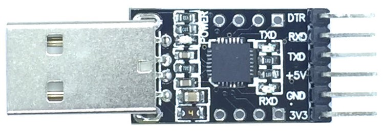
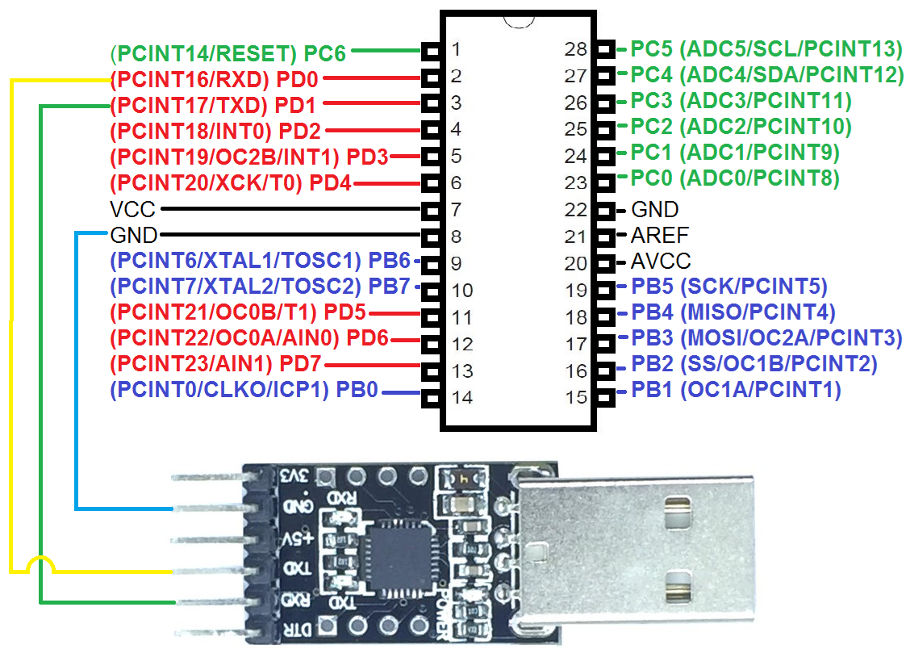

# Subject

we want to send message `Hello World` from `ATmega328p` to local computer `USART` that is a serial data protocol. to do so, we will use following parts:

- `ATmega328p`
- `USB to Serial` convertor module based on chip `CP2102`.  
- 3 male to female jumper wires.
- USBASP programming module.


**HINT:** also we want to simulate this circuit with proteus software. 


# Steps

to accomplish this tutorial we will do the following steps:

- install a Terminal Software on local computer.

- write message sender program in `c` language, and upload it to `ATmega328p`.
- wiring `ATmega328p` with `USB to Serial` convertor.
- config `Terminal Software` and test the result in reality.
- install virtual serial port driver `VSPD` and create 2 virtual ports.
- create circuit in proteus.
- config `Terminal Software` and test the result in proteus.


### Install Terminal Software

in this tutorial we will use `CoolTerm` as our terminal serial. to download and install it refer to the following link:

- https://freeware.the-meiers.org/


### Message Sender Program

based on the tutorial of the link (( https://github.com/hamedvalizadeh/electronic-tutorial/blob/master/Embedded_Programming/BitShifting-ATmega328P-PU-With-WinAVR/Document.md )), upload the following program on `ATmega328p`:

```c
#include <avr/io.h>

#define USART_BAUDRATE 4800
#define UBRR_VALUE 12

void USARTInit(void)
{
    // Set baud rate registers
    UBRR0H = (uint8_t)(UBRR_VALUE>>8);
    UBRR0L = (uint8_t)UBRR_VALUE;
    // Set data type to 8 data bits, no parity, 1 stop bit
    UCSR0C |= (1<<UCSZ01)|(1<<UCSZ00);
    // enable transmission and reception
    UCSR0B |= (1<<RXEN0)|(1<<TXEN0);
}

void USARTSendByte(uint8_t u8Data)
{
    //wait while previous byte has been sent
    while(!(UCSR0A&(1<<UDRE0))){};
    // Transmit data
    UDR0 = u8Data;
}

void HelloWorld(void)
{
    USARTSendByte(72);  // H
    USARTSendByte(101); // e
    USARTSendByte(108); // l
    USARTSendByte(108); // l
    USARTSendByte(111); // o
    USARTSendByte(32);  // space
    USARTSendByte(119); // w
    USARTSendByte(111); // o
    USARTSendByte(114); // r
    USARTSendByte(108); // l
    USARTSendByte(100); // d
    USARTSendByte(32);  // space
}

int main (void)
{
    //Initialize USART0
    USARTInit();
    while(1)
    {
        HelloWorld();
    }
}
```


### Wiring `USB to Serial`

in this tutorial we use `USB to Serial` module based on chip `CP2102`. it is as follow:




the wiring should be as follow:

| ATmega328p | USB To Serial Module |
| :--------: | :------------------: |
|    GND     |         GND          |
|    RXD     |         TXD          |
|    TXD     |         RXD          |





now connect `USB to Serial` module to your local computer. it should automatically install the necessary driver, but if not installed automatically search for `Silicon Labs CP210x USB to UART Bidge` driver and install it manually.


### Test the result

open `CoolTerm` and config it to connect to the port that `USB to Serial` module is connected, and change the baud rate to 4800 and terminal mode to `Line Mode`. we saved this setting in a file named `USART_Real_Terminal.CoolTermSettings`, you can use it by double click it.

finally click on connect button; you should see `Hello World` message written on the terminal continuously.   


### Create Virtual Ports

to be able to simulate the program with proteus, first we need to create 2 virtual ports named `COM1` and `COM2`. 

so download and install `Virtual Serial Port Driver` program from link (( https://p30download.ir/fa/entry/65323/virtual-serial-port-driver )) and create a pair of mentioned port.

then open the file `16_USART_Test_ATmega328p.pdsprj` in proteus and do the following steps:

- double click on `COMPIM` component on the schematic and config it to use `COM1` as physical port and change its baud rate to 4800.
- double click on part `ATmega328p` component on the schematic and choose the produced `hex` file in step `Message Sender Program` as the `Program File`.
- finally click on `Play` button.


### Test the result in Proteus

open `CoolTerm` and config it to connect to the port `COM2`, and change the baud rate to 4800 and terminal mode to `Line Mode`. we saved this setting in a file named `USART_Proteus_Terminal.CoolTermSettings`, you can use it by double click it.

finally click on connect button; you should see `Hello World` message written on the terminal continuously.   

