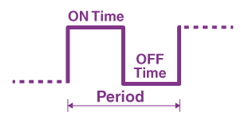
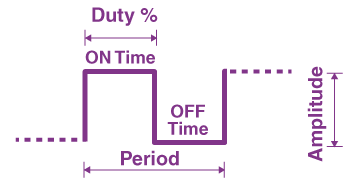
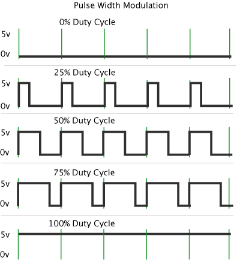
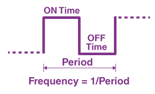

# What is PWM

this is abbreviation of `Pulse Width Modulation`, and is used to control the amount of time that a pin is powered on and off.

imagine you want to turn on an LED with microcontroller. the first option is to set the pin connected to the LED on, that will do the job for you. in this method 5 volt is being powered to the pin constantly (all the time) and consequently the LED will light up with its maximum brightness. the second option is to not also light it up but also control its brightness. to be able to control its brightness we can control the amount of time that it is powered by 5 volt in each cycle of the time. this concept is named `PWM`.

in PWM there are some parameters that we need to be aware of, as following:

- Period

- Duty Cycle
- Frequency
- Output Voltage


#### Period

this is the time in which a whole cycle containing on time and off time is completed.




#### Duty Cycle

this is the most important one. this term refers to the ratio of the duration of time when the signal (voltage level) is high to the duration of time when the signal is low in a period.




duty cycle is measured by percentage. in the following image we can see that based on on and off time we could have different percentages of duty cycle:




#### Frequency

this parameter determines how fast PWM completes a period.



in practice to calculate this parameter, we need to know following amounts:

- microcontroller frequency
- timer pre-scaler value
- timer mode
  - Fast
  - Phase Correct


in **Fast Mode** the value of the the TCNT register counts up from zero to its maximum value, and upon reaching the maximum value, its values resets to 0 and starts to count up.

so the formula would be as follow:

```powershell
f_pwm = f_micro / (pre-scaler * (maximum amount of TCNT))
```

**Example:** in ATTiny85 if we choose pre-scaler to be as 8 and use Timer0 which its TCNT0 max value is 255, and we use internal frequency of micro that is 1 MHZ, then the `f_pwm` will be as `1000000 / (8 * 255)` which is equal to `490.196 HZ`.


in **Correct Phase** mode the value of the the TCNT register counts up from zero to its maximum value, and upon reaching the maximum value, its values counts down to reach to 0.

so the formula would be as follow:

```powershell
f_pwm = f_micro / (pre-scaler * (maximum amount of TCNT) * 2)
```

**Example:** in ATTiny85 if we choose pre-scaler to be as 8 and use Timer0 which its TCNT0 max value is 255, and we use internal frequency of micro that is 1 MHZ, then the `f_pwm` will be as `1000000 / (8 * 255 * 2)` which is equal to `245.098 HZ`.


#### Output Voltage

output voltage is the mean of all duty cycles sum in all periods. as each duty cycle is equal to others and all periods are equal, the formula would be as simple as multiplying input voltage amplitude by the duty cycle.

**Example:** if the input voltage is 5v, and the duty cycle is 60%, the output voltage will be 3v = (0.6 * 5).


# Generate PWM

in general to produce PWM we need to turn on and turn off a pin by the help of timer counter of the microcontroller that is  being compared to an amount that can contain maximum amount of time counter capacity. so in a nutshell we need timer register and compare match register.

the setup steps would be as follow:

- set the direction of the port in which we want to produce PWM.
- config the timer mode. to generate PWM signal, we can use 2 modes of the timer:
  - Fast PWM
  - Phase Correct PWM
- set the timer pre-scaler
- config comparer
- set compare amount


#### Generate PWM in ATTiny85

in this microcontroller we have three pins capable of PWM, that are PB0, PB1, PB3, and PB4.

first config the direction of the desired pin as output by the help of `DDRB` register and bits `PORTB0`, `PORTB1`, and `PORTB4`.


then set the timer mode as `FAST`, or `Phase Correct`:

- in timer0 it could be done by the help of registers `TCCR0A` and `TCCR0B` and bits `WGM00`, `WGM01`, and `WGM02`.

- in timer1 it could be done by the help of register `TCCR1` and bits `PWM1B` and `PWM1A`.


now set the pre-scaler of the chosen timer:

- in timer1 we can set `CS10`, `CS11`, `CS12`, and `CS13` bits of register `TCCR1`.
- in timer0 we can `CS00`, `CS01`, and `CS02` bits of register `TCCR0B`.


this is the time to config the comparer:

- in timer0 we can do it by the help of bits `COM0A0`, `COM0A1`, `COM0B0`, and `COM0B1` of the register `TCCR0A`.
- in timer1 we can set bits `COM1B0`, and `COM1B1` of register `GTCCR`.


finally it is time to set the amount of comparer. based of the chosen port it can be set as follow:

- for port `PB4` we have `OCR1B` register.
- for port `PB0` we have `OCR0A` register.
- for port `PB1` we have `OCR0B` register.


#### Example Of ATTiny85 PWM

- PWM on port PB4 of ATTiny85: https://github.com/hamedvalizadeh/electronic-tutorial/blob/master/Embedded_Programming/avr-workshop-a-hands-on-introduction-with-60-projects/Code/31_PWM_ATTiny85_PB4/main.c


