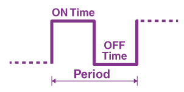
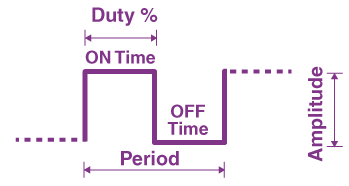
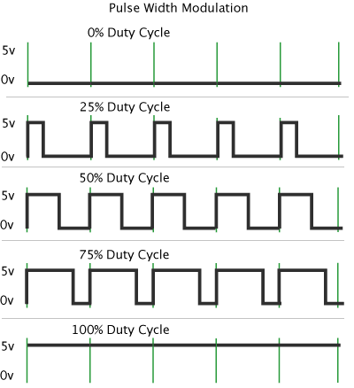

# Timers

in `ATmega328p` there are two 8 bit timers name d`TIMER0` and `TIMER2` that their counter register have maximum value of 255, and one 16 bits timer named `TIMER1` that its counter register has maximum value of 65535.


# Important Concepts

to better understand timer in ATMega328, there are some key concepts to be aware of. they are as follow:

- Top
- Period
- Duty Cycle
- Mode
- Output Voltage
- Frequency


**HINT:** in contents related to timer concept, where-ever you see `nx` it refers to the timer index and register letter. we have three timers in ATMega328, so `n` could be 0, 1, or 2; and some registers have more than one byte that each one is distinguished with a letter that can be any thing from `A` to `Z`. 


---

## TOP

**TOP** is the **maximum value the timer counter ** register counts to before it resets or changes counting direction.

In other words, it defines the **period** (or length) of one complete PWM cycle.

- When `TCNTn` counts **up** from 0 to TOP and rolls over (or counts down in phase-correct modes), one full PWM cycle has occurred.
- So **TOP determines the PWM frequency** (how fast the waveform repeats).


#### Examples

If `TOP = 255` (8-bit mode):

- `TCNTn` counts from 0 → 255, then resets to 0.
- There are 256 timer counts per cycle.

If `TOP = 1999`:

- `TCNTn` counts 2000 steps per PWM cycle.
- The period becomes longer → the frequency becomes lower.


#### Where TOP comes from?

Depending on the **mode**, TOP can come from:

1. **Fixed TOP (8/9/10-bit modes):**  8 bits for timers 0 and 2, but for timer 1 it could be 9 bits and 10 bits
- TOP is hardware fixed (0x00FF, 0x01FF or 0x03FF).
   
- Example modes: Fast PWM / Phase Correct with 8/9/10-bit resolution.
   
- **Both `OCnA` and `OCnB` are available** as PWM outputs.
   
- Frequency is fixed by `F_CPU`, pre-scaler and the fixed TOP.
   
- Use these modes when you accept the discrete set of available frequencies and want both outputs.


2. **ICR1 as TOP modes (variable TOP, both pins active):** it is available just in timer 1
- `TOP = ICR1`. Examples: `FAST` or `PHASE_CORRECT` using ICR1.
   
- **Both OC1A and OC1B remain active** and their duty cycles are `OCRnA/ICR1` and `OCRnB/ICR1`.
   
- You programmatically set `ICR1` to choose PWM frequency and resolution.
   
- Use this when you need an arbitrary frequency/resolution and want both PWM outputs synchronized at the same frequency.


3. **`OCRnA` as TOP modes (variable TOP, `OCnA` disabled)**

   - `TOP = OCR1A`. Example modes: `FAST` or `PHASE_CORRECT` where `OCRnA` is TOP.

   - **`OCnA` is disconnected** — it cannot produce PWM because `OCRnA` is used internally as TOP.

   - `OCR1B` (`OCnB`) still works as the duty compare register, so you can get PWM on `OCnB` only.

   - Use this mode if you only need one PWM output (`OCnB`) and prefer to set TOP via `OCRnA`.


---

## Period

this is the time in which a whole cycle containing on time and off time is completed.




---

## Duty Cycle

this is the most important one. this term refers to the ratio of the duration of time when the signal (voltage level) is high to the duration of time when the signal is low in a period.

It determines the **ratio** of ON time to the total period.

### In hardware terms

The ON/OFF timing is controlled by comparing the timer value (`TCNT`) with the **Output Compare Registers** (`OCRnx`):

- When `TCNTn` < `OCRnx` → output is HIGH.
- When `TCNTn` ≥ `OCRnx` → output toggles or goes LOW (depending on mode).




duty cycle is measured by percentage. in the following image we can see that based on ON and OFF time we could have different percentages of duty cycle:




Duty cycle value is calculated as follow:

```
Duty = (Compare Value) / (TOP Value)

Compare and TOP values depond on the chosen timer mode.
```


---

## Mode

Timers in the ATmega328 provide a range of modes allowing you to choose between:

- **pure timing** (Normal, CTC)
- **high-speed PWM** (Fast PWM)
- **low-distortion PWM** (Phase Correct)
- **high-precision variable-frequency PWM** (PWM with ICR1 or OCR1A as TOP)

Each mode modifies:

- how `TCNTn` counts
- how TOP is chosen
- how the waveform looks
- how `OCnx` behaves
- and how frequency/duty can be controlled


A **mode** defines **how the timer operates** — specifically:

- how timer counter counts (up only, or up and down),
- where timer counter resets (the source of TOP),
- and how the output pins `OCnx` behave when the timer matches a compare value.


### Why modes exist?

Modes give flexibility — you can use the same timer for many tasks. 

modes are as follow:

- **Normal**

  - `TCNTnx` counts up from 0. when it reaches max, it overflow to 0 and triggers overflow interrupt (`TOVn`).
  - `OCnx` pins do not generate PWM. They can only toggle on compare-match if configured, but frequency/duty is not usable for analog output
  - Use Cases:
    - Timing (delays)
    - Overflow Interrupts
    - Free running time
    - Simple time base

- **CTC (Clear Timer on Compare)** 

  - `TCNTnx` counts from 0 to `OCRnx` (TOP)
  - when `TCNTnx` = `OCRnx`, timer resets to 0 and generates compare match interrupt.
  - `OCnx` pins toggle on each compare match.
  - Use Cases:
    - for precise timing without PWM.
    - Generating accurate square waves (tone generation, clock signals)

- **Fast PWM** 

  - `TCNTnx` counts from 0 to TOP. TOP options in this mode are as follow:
    - Fixed
    - `OCRnA`
    - `ICR1` in timer1 only


  - for high-frequency signals
  - This is the most common PWM mode.
  - `OCnx` pins create clear PWM.
  - Use Cases:
    - LED dimming
    - motor speed control
    - PWM control
    - buck/boost convertors

- **Phase Correct PWM** 

  - `TCNTnx` counts from 0 to TOP and from TOP to 0. TOP options in this mode are as follow:
    - Fixed
    - `OCRnA`
    - `ICR1` in timer1 only
  - frequency is lower than Fast PWM (because it counts up AND down)
  - Use Cases
    - for symmetric waveforms (important in motor control).


### Why So Many Modes?

#### CTC

- Best for accurate time intervals
- Best for generating square waves

#### Fast PWM

- Best for LED dimming
- Best for high-speed PWM
- Simple and efficient

#### Phase Correct PWM

- Best for audio or servo
- Symmetric waveform (less jitter)

#### ICR1 as TOP

- Needed when you want variable frequency **AND** want to keep both PWM outputs

#### OCR1A as TOP

- Needed when you want variable frequency **but don't care about using OC1A as PWM**


### How a mode is chosen?

Timer modes are set using **Waveform Generation Mode (WGM)** bits. Each mode defines:

- where **TOP** comes from,
- whether counting is **up-only** or **up-down**,
- and which compare events trigger the `OCnx` pins.


### Why choose different modes?

- **Fixed top (8/9/10-bit)**: 8 bit for timers 0 and 2, but for timer 1 it could be 9 bit and 10 bit 
  - Simpler, both pins available, known frequency presets.
  - Good for standard LED dimming or basic motor PWM where the preset frequency and resolution are fine.
- **`ICR1` as TOP**: it is available just in timer 1
  - Maximum flexibility: arbitrary frequency and resolution (16-bit TOP).
  - Both outputs active → ideal for synchronized dual PWM (e.g., H-bridge, two-phase motor driver).
- **`OCRnx` as TOP**:
  - Useful when you only need a single PWM output and want to set TOP via `OCR1A`. Simpler register usage where TOP and one duty output are handled by the same register (at cost of losing OC1A pin).


---

## Output Voltage

output voltage is the mean of all duty cycles sum in all periods. as each duty cycle is equal to others and all periods are equal, the formula would be as simple as multiplying input voltage amplitude by the duty cycle.

**Example:** if the input voltage is 5v, and the duty cycle is 60%, the output voltage will be 3v = (0.6 * 5).


**Caution:** this value is controllable in PWM as duty cycle can be changed, but in other modes of timer as duty cycle in 50% fixed so always we have half of the input voltage as output.    


---

## Frequency

this parameter determines how fast PWM completes a period.


in practice to calculate this parameter, we need to know following amounts:

- microcontroller frequency
- timer pre-scaler value
- timer mode
  - Fast
    - inverted mode
    - non-inverted mode
  - Phase Correct
    - inverted mode
    - non-inverted mode


#### General Formula

in this section we try to introduce a general formula to calculate timer frequency and simplify the concept.

Yes — that’s a clean, systematic way to think about it.

**General idea:**

```
f_timer = f_clk / denominator

denominator = (timer clock prescaler) × (number of timer ticks per full PWM period)
```


denominator for timer 1:

| Mode (AVR name / typical)                       | ticks per full period          | When to use / notes                                          |
| ----------------------------------------------- | ------------------------------ | ------------------------------------------------------------ |
| **Fast PWM, fixed 8-bit (TOP = 0xFF)**          | 256                            | Timer0 in WGM 3 (WGM02=0,WGM01=1,WGM00=1) → counts 0..255    |
| **Fast PWM, fixed 16-bit (TOP = 0xFFFF)**       | 65536                          | 16-bit full-range (Timer1 fast PWM with TOP = 0xFFFF)        |
| **Fast PWM, TOP = `OCRnA` (variable TOP)**      | `1 + OCRnA`                    | Fast PWM where `OCRnA` defines TOP (common on Timer1 with OCR1A as TOP) |
| **Fast PWM, TOP = `ICRn` (variable TOP)**       | `1 + ICRn`                     | Timer1 when using ICR1 as TOP (useful for custom frequency)  |
| **Phase-Correct PWM, fixed 8-bit (TOP = 0xFF)** | `2 * 256` = 512                | Dual-slope (counts up then down) → frequency half of Fast PWM with same TOP |
| **Phase-Correct PWM, TOP = `OCRnA`**            | `2 * (1 + OCRnA)`              | Phase-correct variant with variable TOP                      |
| **Phase-Correct PWM, TOP = `ICRn`**             | `2 * (1 + ICRn)`               | Typically Timer1 for precise phase-correct frequency         |
| **CTC, toggle OC on compare (square wave)**     | `2 * (1 + OCRnA)`              | Toggle pin on every match → two matches per full output cycle |
| **CTC, non-toggle (match triggers event only)** | `1 + OCRnA`                    | Use for timed events; output pin behavior depends on COM bits |
| **Normal mode (overflow) 8-bit**                | `1 + TOP` (TOP=0xFF) → 256     | Overflow when counter wraps from TOP to 0                    |
| **Normal mode (overflow) 16-bit**               | `1 + TOP` (TOP=0xFFFF) → 65536 | 16-bit overflow period                                       |


**Example:** we want to have  1 kHz  Fast PWM on Timer1 with `ICR1` as TOP

```
What we have: F_CPU = 16,000,000, choose prescaler = 8
what we want: F_PWM = 1,000, TOP = ICR1
what we should do: calculate value for ICR1 and set registers accordingly

f_timer = f_clk / (prescaler * denominator) => 1,000 = 16,000,000 / (8 * (1 + ICR1)) 
=> 1,000 * 8 * (1 + ICR1) = 16,000,000 => 1 + ICR1 = 16,000,000 / (8 * 1,000) => ICR1 = (16,000,000 / (8 * 1,000)) - 1
=> ICR1 = 1,999

now that we now the value of ICR1 which is our top, we should set timer1 registers to config it to have prescalar as 8, mode to Fast PWM with ICR1 as Top.
```

