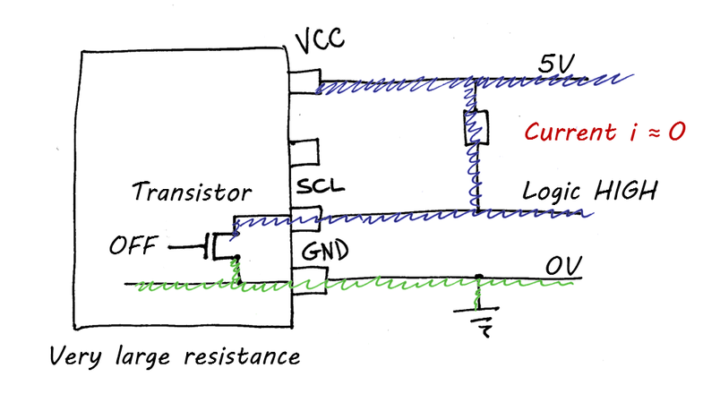

## How many Devices can you Connect to the I²C Bus?

If you ever posted that question on any discussion forum for Arduino users, electronic enthusiasts, and fellow engineers, you will get answers like this:

- “You have a 7-bit address. That means you can address up to 127 slaves.”
- “The number of devices connected to the bus is only limited by the total allowed bus capacitance of 400 pF.”
- “Short answer: it depends!” 

Well, thank you Internet. I’m feeling smarter already. But seriously, how many sensors can I connect to my Arduino using the I²C bus?

The last answer was arguably the most correct one, but only because the question was so vague! So, let’s try to rephrase that question. When you say “sensor”, do you mean a sensor mounted on a breakout board? Yes? Now that makes a huge difference! So, the question now becomes: how many breakout boards can you connect on the I²C bus? 

This problem is much easier to solve, and I’m sorry to say, the answer is way lower than 127.

## Basics on the I²C Bus

Yes, we are taking a quick look at the basics of the I²C bus. But we don’t need to dig too deep to answer our question. 

Let’s pretend that this horrible mess of wiggly lines is a device with four pins. Besides the VCC pin to supply your device with power and the GND pin to do whatever ground pins do, you also have the serial data (SDA) and the serial clock (SCL) pins.

Maybe you’ve noticed, both the SDA and the SCL pins are connected to the ground through a switch within the device. This is, of course, a very simple representation. When you connect two devices using the I²C bus, you just need to connect the VCC pin from one device to the VCC pin from the other device and do the same to the SDA, SCL, and GND pins. Well, just look at the pretty picture!

One of the devices will assume the role of the Master. That means that it will be in charge of generating the clock signal on the SCL line, and use the SDA line to send commands to the Slave. The Slave, on the other hand, uses the SDA line to send data back to the Master. In most situations, the Arduino will be the Master, while any device being controlled by the Arduino, like a sensor, will act as a Slave. 

But we’re not done yet! For the I²C bus to work, we need to connect one resistor between the VCC line and the SDA line, as well as another resistor between the VCC line and the SCL line. These are called Pull-up Resistors.

]

How does it look like if we have more than one Slave, i.e. more than one sensor connected to the Arduino? Well, in this case, you would still have one resistor for the SDA line and another for the SCL line. It doesn’t matter if you have only one sensor or fifty sensors connected to your Arduino. You only need one resistor on the SCL line and one resistor on the SDA line.

But why is that? Why do we need any resistors at all? And why should I care? Well, as you might be suspecting by now, one of the main problems caused by connecting multiple breakout boards on the I²C bus is caused by pull-up resistors. 

## Generating a Signal on the SCL Line

To understand this, let’s see how a digital signal is generated, for example, on the SCL line. The SDA line works the same way, but for the sake of clarity, I am only showing the SCL line here.

In this circuit, the voltage on the VCC line is 5 V (or 3.3 V, depending on your power supply), and the voltage on the GND line is 0 V. The voltage on the SCL line, the actual signal being generated, depends on the position of the switch. 

If the switch is open, the 5 V potential from the VCC line will also be on the SCL line. In this case, the voltage on the SCL line will be 5V and the signal will be interpreted as a logic HIGH. Since the switch is open, there will be no current flowing through the device.

If the switch is closed, the 0 V from the GND line will also be on the SCL line and the signal will be interpreted as a logic LOW. Now we have a difference of potential across the resistor and a current will be flowing through the switch.

Opening and closing the switch generates a nice digital signal, varying between 0 V and 5 V. 

## Measuring the SCL Signal on the I²C Bus

Of course, this is what an ideal digital signal looks like, but let’s see what a real signal looks like. If you connect a single sensor mounted on a breakout board and connect it to your Arduino using the I²C bus, you would have something like this:

Great, now take an oscilloscope and measure the signal on the SCL line. What do you see?

As you can see, the blue line, the measured signal on the SCL line, is quite different from the ideal signal. The maximum value is a bit lower than 5 V, the minimum value is a bit higher than 0 V and the voltage takes a long time to go from 0 V to 5 V. Despite all that, this is what a good signal looks like! 

Now let’s pretend we are connecting not one breakout board to an Arduino, but multiple boards at the same time.

As mentioned earlier, connecting multiple sensors on the I²C bus means connecting the SCL pins from all boards to each other. Therefore, the SCL signal being generated by the Arduino is shared by all sensors. The same applies to the SDA signal, as well as to the power supply (VCC) and the ground (GND). So, what does the SCL signal look like now?

The new SCL signal, shown in red, looks somehow more like the ideal signal than before. The voltage at logic LOW is now much higher than before. But the voltage at logic HIGH looks the same and now the voltage increases much faster from low to high. Well, it’s not that bad, right? 

Very wrong! And the single reason is the new voltage at logic LOW. To understand how bad that is, let’s go back to our first diagram. 

## Back to the Basics on the I²C Bus

Earlier I’ve shown a mechanical switch connected between the SCL pin and the GND pin. But there are no mechanical switches within the device. Instead, the connection is made by a transistor operating as a switch.

By turning the transistor ON and OFF, you can change the SCL signal to logic LOW and logic HIGH. When the transistor is OFF, the resistance on the transistor between the SCL and the GND pins is very high. This way, practically no current flows through the transistor and, consequently, through the resistor. The voltage on the SCL line will be very close to 5 V, so it will be interpreted as a logic HIGH.

When the transistor is ON, the resistance across the transistor becomes very small, however, it is not zero. A small current now flows through the resistor and, most importantly, across the transistor. The voltage on the SCL line is equal to the voltage drop across the transistor. Since this voltage drop is very close to 0 V, the SCL signal will be interpreted as a logic LOW.

Now comes the big question: what happens if we decrease the resistance of the pull-up resistor? The current across the resistor increases, of course. But the same current also flows through the transistor!

A larger current across the transistor leads to more heat being dissipated within the device, and overheating is a major cause of failures of semiconductor devices. Knowing that the [I²C bus Specification and User Manual](https://www.nxp.com/docs/en/user-guide/UM10204.pdf) sets a maximum of 3 mA across the transistor. This current is known as a sink current.

That means that devices specified for using the I²C bus must work with a sink current of 3 mA flowing across the transistor. It also means that circuit designers should consider this limit when dimensioning the pull-up resistors.

And how do we know if the sink current in our circuit is above the 3 mA limit? Well, increasing the sink current means that the voltage drop across the transistor also increases. The voltage drop across the transistor, or the low-level output voltage, is the voltage level when the signal is at a logic LOW.

The I²C bus specification and user manual also set a maximum of 0.4 V for the low-level output voltage. This is because it indicates that a maximum sink current of 3 mA is flowing across the transistor. Therefore, whenever we measure the SDA or SCL signals and the voltage at logic LOW is higher than 0.4 V, we know that the sink current is too high!

With the maximum sink current of 3 mA and the maximum low-level output voltage of 0.4 V, we can calculate the minimum value for the pull-up resistors. All we have to do is consider the worst-case situation when operating within the specification. The minimum value for each pull-up resistor equals the voltage drop across the resistor divided by the maximum sink current of 3 mA.

For a power supply of 5 V, each pull-up resistor must have at least 1.53 kΩ, while for a power supply of 3.3 V, each resistor must be of at least 967 Ω.

Of course, it does not mean that whenever the sink current goes beyond 3mA, the device will stop working immediately. But you should always be careful when operating a device beyond its specification. This can lead to communication failures, reduce its lifetime, and even damage the device permanently.

## Finally, how many breakout boards can you connect?

Now back to our problem: how many breakout boards can you connect on the I²C bus? Not many… You probably noticed already, each breakout board has its pair of pull-up resistors. The value of these resistors varies from board to board, but most have 10 kΩ, 4.7 kΩ, or 2.2 kΩ.

When we connect multiple breakout boards, we are connecting these resistors in parallel to each other, decreasing the total resistance. Even connecting two boards with pull-up resistors of 2.2 kΩ would reduce the overall resistance to 1.1 kΩ. That would still be fine for a power supply of 3.3 V but would be lower than the minimum value of 1.53 kΩ for a VCC of 5 V. 

In the best-case scenario, using boards with pull-up resistors of 10 kΩ, you could connect 10 boards, resulting in a total pull-up resistance of 1 kΩ. This would be fine for a VCC of 3.3 V. For a VCC of 5 V however, you could connect 6 boards with pull-up resistors of 10 kΩ each, resulting in a total resistance of 1.67 kΩ.

You can also measure the total resistance on the SCL or SDA line with a multimeter. All you have to do is disconnect the power supply from your circuit and measure the resistance between the SCL pin (or SDA pin) and the VCC pin. 

I hope this article can help you understand the I²C bus a little more.

Source: https://bluedot.space/tutorials/how-many-devices-can-you-connect-to-the-i2c-bus/